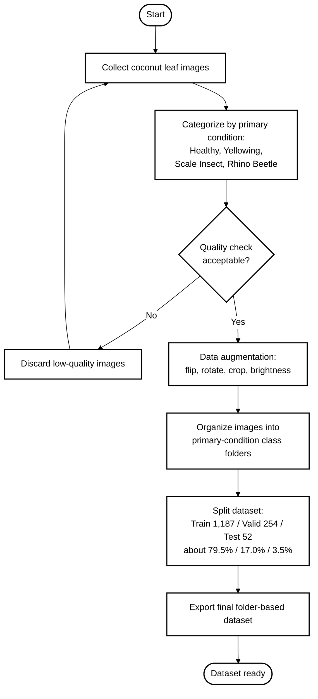
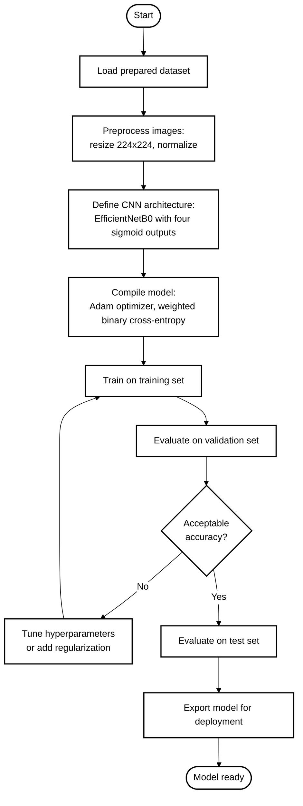
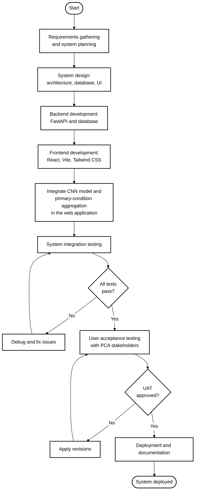
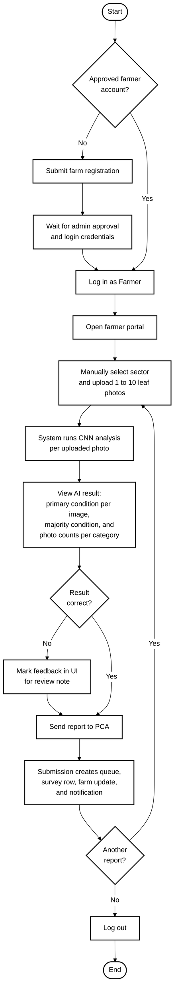
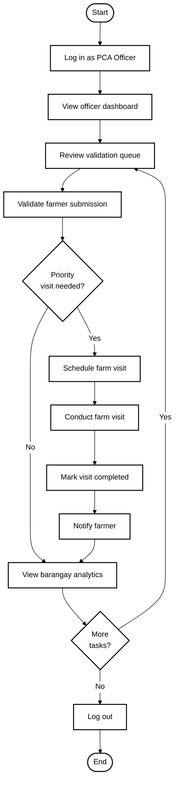
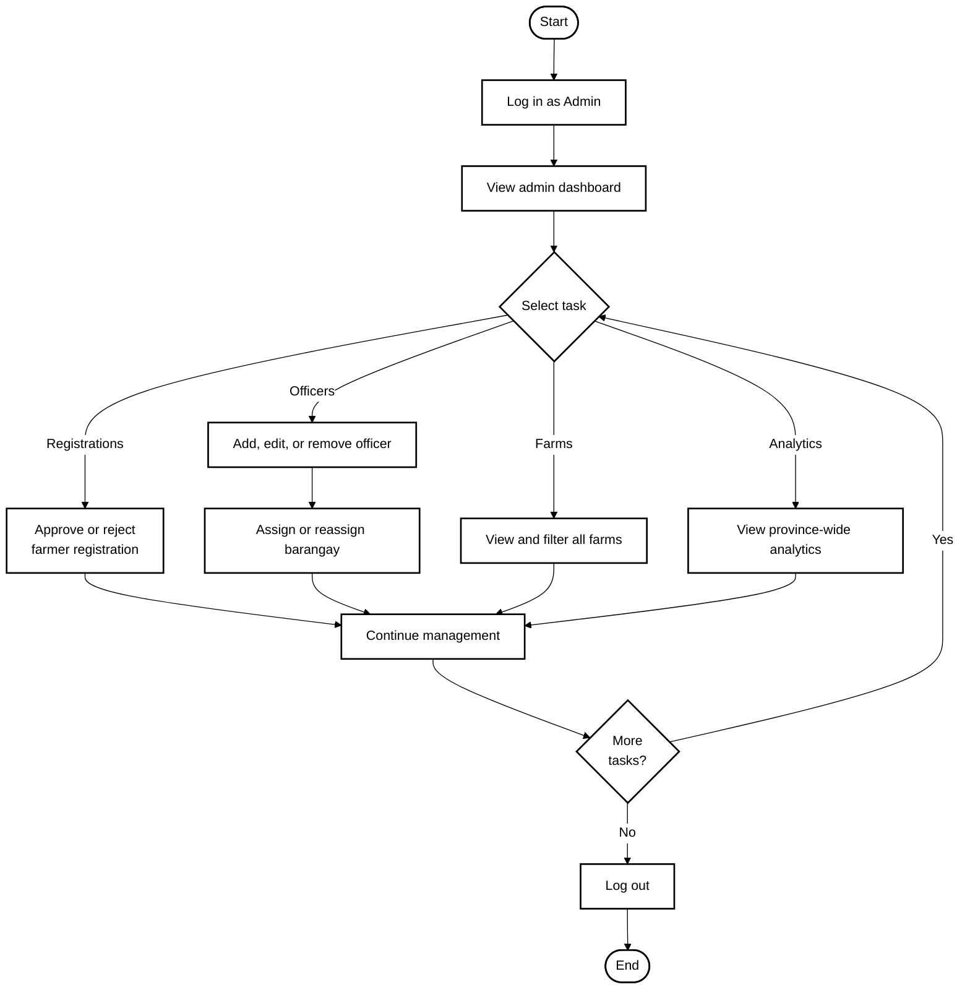

# Chapter 3 — Diagrams and Flowcharts

PCA Negros Occidental Coconut Health Monitoring System

Open this file in Cursor/VS Code with a Mermaid preview extension (**Ctrl+Shift+V**), or paste each block into [mermaid.live](https://mermaid.live) to export PNG/SVG for your thesis.

All shapes: **white fill**, **black outline** (2px), **black text and arrows**.

---

## Section 1 — Project Design

Describes the structure and design of the system before development begins.

### Use Case Diagram

Shows what each user role can do: **Farmer**, **PCA Officer**, and **Admin**.

```mermaid
%%{init: {"theme":"base","themeVariables":{"background":"#ffffff","primaryColor":"#ffffff","primaryTextColor":"#000000","primaryBorderColor":"#000000","secondaryColor":"#ffffff","secondaryTextColor":"#000000","secondaryBorderColor":"#000000","tertiaryColor":"#ffffff","tertiaryTextColor":"#000000","tertiaryBorderColor":"#000000","lineColor":"#000000","textColor":"#000000","actorBorder":"#000000","actorBkg":"#ffffff","actorTextColor":"#000000","actorLineColor":"#000000","labelBoxBkgColor":"#ffffff","labelBoxBorderColor":"#000000","labelTextColor":"#000000","mainBkg":"#ffffff","nodeBorder":"#000000","clusterBkg":"#ffffff","clusterBorder":"#000000","edgeLabelBackground":"#ffffff","nodeTextColor":"#000000"}}}%%
useCaseDiagram
    left to right direction

    actor Farmer
    actor "PCA Officer" as Officer
    actor Admin

    rectangle "PCA Coconut Health Monitoring System" {
        (Register Farm)
        (Upload Leaf Photo)
        (View AI Result)
        (Send Report to PCA)
        (View Notifications)

        (Review Validation Queue)
        (Validate Farmer Submission)
        (Schedule Farm Visit)
        (Mark Visit Complete)
        (View Barangay Analytics)

        (Approve Registration)
        (Manage Officers)
        (Assign Barangay)
        (View All Farms)
        (View Province Analytics)
    }

    Farmer --> (Register Farm)
    Farmer --> (Upload Leaf Photo)
    Farmer --> (View AI Result)
    Farmer --> (Send Report to PCA)
    Farmer --> (View Notifications)

    Officer --> (Review Validation Queue)
    Officer --> (Validate Farmer Submission)
    Officer --> (Schedule Farm Visit)
    Officer --> (Mark Visit Complete)
    Officer --> (View Barangay Analytics)

    Admin --> (Approve Registration)
    Admin --> (Manage Officers)
    Admin --> (Assign Barangay)
    Admin --> (View All Farms)
    Admin --> (View Province Analytics)
```

---

## Section 2 — Project Development

Describes how the system was built.

### Dataset Preparation Flowchart

Shows image collection through the final dataset.



### CNN Model Training Flowchart

Shows the CNN training process.



### System Development Flowchart

Shows overall development from planning to deployment.



---

## Section 3 — Operation and Testing Procedure

Describes how each role uses the system during operation and testing.

### Farmer Usage Flowchart

How a farmer uses the system.



### PCA Officer Usage Flowchart

How a PCA officer uses the system.



### Admin Usage Flowchart

How an admin manages the system.


